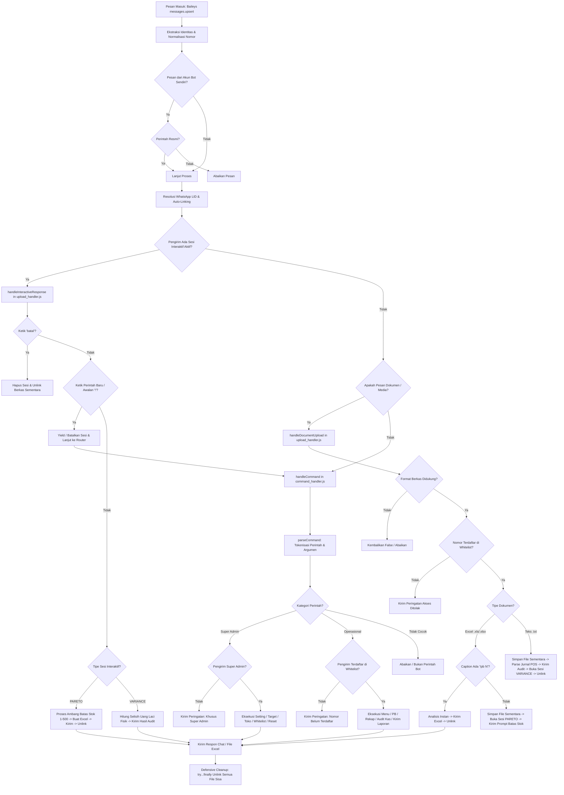

# Panduan Arsitektur & Manual Pengembang: WhatsApp Bot Toko OMI

Selamat datang di **Panduan Arsitektur & Manual Pengembang WhatsApp Bot Toko OMI (Titan Eksekutif Mart)**. Dokumen ini disusun secara khusus sebagai panduan komprehensif, edukatif, dan ramah pemula (*beginner-to-intermediate*) bagi pengembang, pengelola sistem, serta administrator toko yang ingin memahami, memelihara, dan mengembangkan ekosistem bot WhatsApp ini secara mandiri tanpa merusak stabilitas sistem yang telah berjalan (*Zero Regression*).

---

## Daftar Isi
1. [Bab 1: Pendahuluan & Filosofi Refaktorisasi](#bab-1-pendahuluan--filosofi-refaktorisasi)
2. [Bab 2: Peta Arsitektur & Peran Setiap File/Modul](#bab-2-peta-arsitektur--peran-setiap-filemodul)
3. [Bab 3: Diagram Siklus Hidup Pesan (Message Lifecycle Flowchart)](#bab-3-diagram-siklus-hidup-pesan-message-lifecycle-flowchart)
4. [Bab 4: Manajemen Koneksi, Keamanan Sesi & Error Handling](#bab-4-manajemen-koneksi-keamanan-sesi--error-handling)
5. [Bab 5: Tutorial Praktis: Cara Menambah Fitur Baru Secara Mandiri](#bab-5-tutorial-praktis-cara-menambah-fitur-baru-secara-mandiri)
6. [Bab 6: Panduan Pengujian & Jaminan Mutu (Zero Regression)](#bab-6-panduan-pengujian--jaminan-mutu-zero-regression)
7. [Bab 7: FAQ & Pemecahan Masalah (Troubleshooting)](#bab-7-faq--pemecahan-masalah-troubleshooting)
8. [Lampiran: Glosarium Istilah Teknis](#lampiran-glosarium-istilah-teknis)

---

## Bab 1: Pendahuluan & Filosofi Refaktorisasi

### 1.1 Latar Belakang: Bahaya File Monolitik (*God Object*)
Pada versi awal pengembangannya, bot WhatsApp ini beroperasi menggunakan satu file utama, yaitu `index.js`, yang membengkak hingga melebihi **1.300 baris kode**. Dalam dunia rekayasa perangkat lunak, fenomena ini dikenal sebagai antipola *God Object* atau file monolitik.

Mengapa file monolitik sangat berbahaya bagi operasional toko?
1. **Kopling Terlalu Erat (*Tight Coupling*)**: Logika koneksi socket Baileys, pembacaan file Excel Pareto, parsing log kasir POS, routing perintah Super Admin, alur obrolan interaktif, hingga cron job penentu closing bercampur di satu tempat. Mengubah satu baris format laporan penjualan berisiko merusak alur download media WhatsApp.
2. **Sulit Diuji (*Hard to Test*)**: Ketika ingin menguji rumus persentase pencapaian (ACH) atau parsing desimal koma (`21,00`), penguji terpaksa harus menginisialisasi socket WhatsApp dan login QR terminal.
3. **Kebocoran Memori & File Sampah (*Resource Leaks*)**: Pada arsitektur monolitik, proses pembuatan file Excel sementara sering kali tertinggal di hard disk ketika terjadi error jaringan. Selain itu, pendaftaran timer `setInterval` yang bertumpuk setiap kali koneksi WhatsApp terputus-sambung mengakibatkan pengingat closing terkirim berulang kali.
4. **Kurva Belajar yang Terjal (*High Cognitive Load*)**: Bagi programmer baru atau admin toko yang hanya ingin menambah satu perintah sederhana (misalnya `!info`), membaca 1.300 baris kode yang rumit menimbulkan kebingungan dan kecemasan tinggi akan merusak sistem yang sedang melayani transaksi kasir.

### 1.2 Prinsip Desain: Clean Architecture & SOLID
Untuk mengatasi permasalahan di atas, proyek ini direfaktorisasi secara menyeluruh dengan mengadopsi prinsip-prinsip desain modern:

* **Separation of Concerns (SoC - Pemisahan Tanggung Jawab)**:
  Logika program dipartisi menjadi domain-domain independen. Modul koneksi hanya mengurusi protokol WhatsApp; modul perintah hanya membaca teks perintah; modul upload hanya menangani berkas media; dan modul scheduler hanya mengawasi detak jam.
* **Single Responsibility Principle (SRP - Prinsip Tanggung Jawab Tunggal)**:
  Setiap file/modul hanya memiliki **satu alasan untuk berubah**. Jika format mata uang Rupiah ingin diubah, satu-satunya file yang disentuh adalah `src/formatters.js`. File lain tidak perlu diutak-atik.
* **Clean Architecture & Lapisan Domain Independen**:
  Modul logika bisnis murni (*Domain Helpers* di root: `pareto_analyzer.js`, `rekap_helper.js`, `struk_parser.js`, `config_helper.js`, `whitelist_helper.js`) tidak bergantung pada protokol WhatsApp sama sekali. Modul-modul ini dapat dijalankan, diuji, dan dieksekusi secara independen dari console biasa.
* **Kemudahan Pemeliharaan (*Maintainability & Scalability*)**:
  File bootstrap `index.js` dipangkas drastis dari >1.300 baris menjadi file entry point ramping (**kurang dari 150 baris**), yang berfungsi murni sebagai konduktor/orkestrator orkestra yang menghubungkan modul-modul di folder `src/`.

---

## Bab 2: Peta Arsitektur & Peran Setiap File/Modul

### 2.1 Struktur Folder Proyek
Berikut adalah perbandingan struktur folder proyek setelah proses refaktorisasi modular:

```text
c:\projek bot\
├── index.js                     <-- Bootstrap & entry point ramping (<150 baris)
├── PANDUAN_ARSITEKTUR.md        <-- Dokumentasi edukatif arsitektur & manual pengembang
├── package.json                 <-- Konfigurasi Node.js ES Module ("type": "module")
├── config.json                  <-- Database setelan toko, target RAB, & jadwal otomatis
├── whitelist.json               <-- Database nomor terdaftar, Super Admin, & WhatsApp LID
├── rekap_data.json              <-- Database rekaman performa penjualan harian (MTD)
│
├── src/                         <-- FOLDER UTAMA ARSITEKTUR MODULAR
│   ├── formatters.js            <-- Utilitas sentral format angka, rupiah, tanggal, & regex
│   ├── connection.js            <-- Manajemen koneksi Baileys, interceptor error, & sesi
│   ├── upload_handler.js        <-- Handler dokumen Excel (.xls/.xlsx) & Jurnal Kasir (.txt)
│   ├── command_handler.js       <-- Router perintah WhatsApp (Super Admin & Operasional)
│   └── scheduler.js             <-- Penjadwal cron job closing & rekap bulanan (anti-leak)
│
├── whitelist_helper.js          <-- [Domain Helper] Pengelola otorisasi & auto-link LID
├── config_helper.js             <-- [Domain Helper] Pengelola konfigurasi target & toko
├── pareto_analyzer.js           <-- [Domain Helper] Mesin analisa ABC Pareto & file Excel PB
├── rekap_helper.js              <-- [Domain Helper] Mesin kalkulasi rekap MTD & Excel bulanan
├── struk_parser.js              <-- [Domain Helper] Parser jurnal kasir POS & audit variance
│
├── struck/                      <-- Direktori penampung log jurnal POS lokal (02-YYYYMMDD.TXT)
├── sesi_bot/                    <-- Direktori multi-device auth Baileys (creds.json & sesi)
└── tests/                       <-- Direktori pengujian mutu komprehensif (Tier 1 - 4)
```

---

### 2.2 Rincian Modul di Folder `src/`

#### 1. `index.js` — *The Lean Orchestrator & Entry Point*
* **Ukuran**: < 150 baris (Target: ~70–90 baris).
* **Fungsi Utama**: Titik awal (*entry point*) saat bot dijalankan via `npm start` atau `node index.js`.
* **Tanggung Jawab**:
  1. Menginisialisasi koneksi WhatsApp melalui `startWhatsAppConnection()` dari `src/connection.js`.
  2. Mendaftarkan pendengar event koneksi (`onOpen`): mengaktifkan penjadwal otomatis melalui `startScheduler(sock)` dari `src/scheduler.js`.
  3. Mendaftarkan pendengar pesan masuk (`onMessage`): mengekstrak identitas pengirim, menangani auto-link WhatsApp LID, lalu mengalirkan pesan ke `handleInteractiveResponse()`, `handleDocumentUpload()`, dan `handleCommand()`.

#### 2. `src/formatters.js` — *Centralized Formatting Utilities*
* **Tujuan**: Menghilangkan duplikasi kode pemformatan yang sebelumnya tersebar di 4 file berbeda.
* **Fungsi-Fungsi Ekspor**:
  * `formatRp(val)`: Mengonversi angka integer atau string ke format Rupiah standar Indonesia (contoh: `4725000` $\rightarrow$ `"4.725.000"`). Mampu menangani nilai negatif, string kotor, serta mencegah bug `-0`.
  * `parseNominal(val)`: Membersihkan karakter non-angka dan mengembalikan nilai numerik murni.
  * `parseSafeFloat(val)`: Mendukung konversi angka desimal berformat lokal Indonesia yang menggunakan tanda koma (contoh: `"21,50"` $\rightarrow$ `21.50`). Mendukung pula angka ribuan bertitik (`"1.500.000"` $\rightarrow$ `1500000`).
  * `calculateAch(actual, target)`: Menghitung persentase pencapaian $\frac{\text{actual}}{\text{target}} \times 100\%$ secara defensif. Menghasilkan string dua desimal (contoh: `"102.50"`), dan otomatis mengembalikan `"0.00"` jika nilai target $\le 0$ guna mencegah galat *Division-by-Zero* (`Infinity`/`NaN`).
  * `escapeRegex(str)`: Melindungi karakter khusus regex (`.*+?^${}()|[]\`) dari potensi *regex injection* saat mencocokkan kata kunci.
  * `formatDateIndo(date)`: Menghasilkan tanggal formal bahasa Indonesia (contoh: `"26 September 2026"`).
  * `formatMonthYearIndo(date)`: Menghasilkan nama bulan dan tahun (contoh: `"September 2026"`).
  * `formatDateFileName(date, style)`: Menghasilkan tag tanggal ramah berkas tanpa spasi atau garis miring (contoh: `"26-09-2026"` atau `"26_September_2026"`).

#### 3. `src/connection.js` — *Baileys Connection, Session & Error Interceptors*
* **Tanggung Jawab**:
  * **Pencegatan Error Libsignal (`setupLibsignalInterceptors`)**: Mencegat galat internal protokol kriptografi Baileys multi-device (`Bad MAC`, `Over 2000 messages`, `SessionError`, `Closing stale open session`) agar tidak memicu *unhandled rejection* yang dapat mematikan proses Node.js.
  * **Pembersihan Sesi Usang (`cleanupOldSessions`)**: Menghapus file `session-*.json` di folder `sesi_bot/` yang berumur lebih dari 7 hari guna mencegah penumpukan file ribuan yang mengikis kuota inode/disk. File vital `creds.json` tetap terlindungi.
  * **Pembersihan Berkas Yatim Piatu Saat Booting (`cleanupOrphanedFiles`)**: Menghapus berkas temporer sisa (`pareto_uploaded_*`, `pos_uploaded_*`, `Laporan_PB_Pareto_*`, `Rekap_Bulanan_*`) jika bot sempat mati mendadak pada sesi sebelumnya.
  * **Pabrik Koneksi Socket Baileys (`startWhatsAppConnection`)**: Mengelola inisialisasi socket Baileys, rendering kode QR di terminal menggunakan `qrcode-terminal`, serta logika *reconnect backoff* bertingkat (3 detik untuk logout/reset, 10 detik untuk status 428/sesi digantikan, 5 detik untuk disconnect sementara).

#### 4. `src/upload_handler.js` — *Media, Document Uploads & Interactive State Machine*
* **Tanggung Jawab**:
  * **Deteksi & Filter Berkas**: Mengidentifikasi pesan dokumen bertipe Excel (`.xls`, `.xlsx`) dan teks jurnal kasir (`.txt`), memverifikasi hak akses nomor pengirim via whitelist.
  * **Alur Dokumen Excel Pareto**: Mengunduh berkas ke disk sementara. Jika caption mengandung `!pb [N]` (contoh: `!pb 5`), analisis dijalankan secara instan. Jika tanpa caption, sistem menyimpan state dan mengirimkan pesan interaktif yang menanyakan batas stok (default, 5 pcs, atau angka lain).
  * **Alur Log Jurnal Kasir POS (.txt)**: Membaca teks ter-encode *latin1*, mengekstrak ringkasan penjualan shift (Cash, E-Money, EDC, Voucher), serta secara otomatis mengaktifkan sesi interaktif rekonsiliasi kas fisik laci kasir.
  * **Mesin Keadaan Interaktif (*Interactive State Machine*)**: Mengelola state in-memory `userSessions` berbasis Map untuk alur Pareto (`type: 'PARETO'`) dan selisih laci (`type: 'VARIANCE'`). Dilengkapi *timeout* 10 menit, penanganan pembatalan kata kunci `batal`, serta *command pass-through* jika pengguna mengetik perintah lain.
  * **Siklus Hidup Pembersihan Ganda (*Double-Unlinking Lifecycle*)**: Menjamin berkas yang diunggah dan berkas Excel yang dihasilkan selalu dihapus dari hard disk melalui blok `try ... finally`.

#### 5. `src/command_handler.js` — *Command Router & Dispatcher*
* **Tanggung Jawab**:
  * **Tokenisasi Perintah (`parseCommand`)**: Memecah teks pesan menjadi token perintah (`command`), array argumen (`args`), dan teks sisa (`payload`).
  * **Middleware Hak Akses**: Memisahkan izin antara **Super Admin** (kendali penuh konfigurasi dan whitelist) dan **Admin Biasa/Allowed Users** (akses operasional toko).
  * **Rangkaian Perintah Super Admin**:
    * `!setting` / `!config`: Menampilkan ringkasan setelan toko & target RAB.
    * `!settarget [nominal]`: Mengubah target penjualan harian (SPD).
    * `!setrab [spd] [std] [apc] [gm]`: Mengatur 4 parameter target RAB sekaligus (mendukung format desimal koma `21,00`).
    * `!settoko [Nama] | [Kode] | [Cabang]`: Mengubah data identitas toko.
    * `!setstok [angka]`: Mengubah ambang batas default stok kritis PB (1–500).
    * `!setreminder [jam:menit / off]`: Menyetel jadwal pengingat closing harian.
    * `!setjam [jam:menit]`: Menyetel jam rekap otomatis akhir bulan.
    * `!setvalidasi [min] [max]`: Menyetel rentang validasi wajar SPD harian.
    * `!tambahnomor [no] [nama]`: Mendaftarkan nomor baru sekaligus mencari dan menautkan WhatsApp LID via `sock.onWhatsApp()`.
    * `!linklid [no] [lid]`: Menautkan nomor HP dengan ID multi-device LID.
    * `!hapusnomor [no]`: Menghapus hak akses nomor dari bot.
    * `!listnomor` / `!whitelist`: Menampilkan seluruh daftar nomor yang memiliki akses.
    * `!resetdata`: Mengarsipkan `rekap_data.json` lama dan mengosongkan data untuk bulan baru.
  * **Rangkaian Perintah Operasional**:
    * `menu` / `!menu` / `lapor`: Mengirimkan template laporan penjualan harian dan daftar menu operasional.
    * `!auditkas` / `!cekshift`: Mengaudit jurnal kasir POS terbaru di folder `struck/` dan memicu alur cek selisih laci.
    * `!pb` / `!pb [angka]`: Menganalisis file Excel Pareto terbaru dan menyajikan ringkasan item stok kritis via chat.
    * `!pb excel`: Menghasilkan dokumen Excel rekomendasi order restock untuk dikirim ke suplier.
    * `!rekap`: Menampilkan ringkasan capaian performa MTD toko bulan berjalan.
    * `!rekap excel`: Menghasilkan spreadsheet Excel rekapitulasi harian lengkap (Multi-sheet).
    * `!hapusdata`: Menghapus data laporan hari ini jika terjadi kesalahan input kasir.
    * `!kirimlaporan`: Mem-parsing 18 indikator performa toko dari teks kasir, memvalidasi batas kewajaran SPD, menghitung persentase pencapaian (ACH), dan menyimpannya ke `rekap_data.json`.

#### 6. `src/scheduler.js` — *Automated Background Cron Jobs*
* **Tanggung Jawab**:
  * **Evaluasi Periodik Mandiri (Detak 60 Detik)**: Berjalan setiap 60 detik tanpa dependensi eksternal (murni native Node.js `setInterval`), mengevaluasi waktu lokal server secara presisi.
  * **Pengingat Closing Harian (*Daily Closing Reminder*)**: Membaca jadwal aktif dari `config.json`. Jika waktu server berada dalam rentang jendela $\pm 2$ menit dari jam closing (default 21:45 WIB), bot membroadcast pesan pengingat ke seluruh staf operasional. Dilengkapi kunci tanggal unik `lastReminderDate` sehingga hanya terkirim tepat 1 kali per hari.
  * **Rekapitulasi Bulanan Otomatis (*End-of-Month Recap*)**: Pada malam hari terakhir setiap bulan (`tomorrow.getDate() === 1`), tepat pada jam yang ditentukan (default 23:00 WIB, jendela $\pm 4$ menit), bot otomatis mengompilasi `rekap_data.json` menjadi berkas Excel rekap bulanan dan mengirimkannya ke seluruh Super Admin.
  * **Pemberantasan Timer Leak (*Idempotent Lifecycle*)**: Fungsi `startScheduler(sock)` selalu memanggil `stopScheduler()` terlebih dahulu untuk membersihkan timer lama sebelum membuat interval baru. Hal ini mencegah bertumpuknya timer saat WhatsApp mengalami putus-sambung (*reconnection*).

---

### 2.3 Modul Pembantu di Root (*Domain Helpers*)

Modul-modul ini sengaja dipertahankan di root direktori guna memelihara kompatibilitas penuh dengan skrip luar dan seluruh rangkaian unit test yang telah ada:

| File Helper | Tanggung Jawab Utama | Bergantung pada Baileys? |
| :--- | :--- | :---: |
| `whitelist_helper.js` | Normalisasi E.164, penyimpanan `whitelist.json`, resolusi hak akses Super Admin/Admin Biasa, dan penautan akun Multi-Device `@lid`. | **TIDAK** |
| `config_helper.js` | Pembacaan dan pembaruan `config.json` secara aman, ringkasan setelan profil toko dan target penjualan. | **TIDAK** |
| `pareto_analyzer.js` | Klasifikasi ABC kontribusi kumulatif 80% (Pareto 80/20), perhitungan stok sisa, dan penyusunan berkas Excel rekomendasi restock suplier. | **TIDAK** |
| `rekap_helper.js` | Agregasi data penjualan harian toko, perbandingan SPD harian terhadap target RAB, dan ekspor spreadsheet bulanan. | **TIDAK** |
| `struk_parser.js` | Parsing berkas teks log jurnal POS OMI, pemisahan shift kasir, ekstraksi transaksi tunai/EDC/QRIS, dan perhitungan varian fisik laci. | **TIDAK** |

---

## Bab 3: Diagram Siklus Hidup Pesan (Message Lifecycle Flowchart)

Setiap pesan yang masuk ke bot—baik berupa perintah teks, percakapan angka, maupun unggahan berkas dokumen—melewati pipa pemrosesan (*processing pipeline*) yang terstruktur ketat.

### 3.1 Diagram Visual (Mermaid)



---

### 3.2 Diagram Visual (ASCII Art)

```text
+-----------------------------------------------------------------------------------+
|                           PESAN MASUK DARI WHATSAPP                               |
|                         (Baileys: messages.upsert)                                |
+-----------------------------------------+-----------------------------------------+
                                          |
                                          v
+-----------------------------------------------------------------------------------+
| 1. RESOLUSI PENGIRIM & NORMALISASI NOMOR (index.js / whitelist_helper.js)         |
|    - Normalisasi nomor HP ke format E.164 (08xx -> 628xx).                        |
|    - Resolusi Multi-Device LID (@lid -> nomor telepon terdaftar).                |
|    - Cek status otorisasi: isSenderSuperAdmin & isSenderAllowed.                  |
+-----------------------------------------+-----------------------------------------+
                                          |
                                          v
+-----------------------------------------------------------------------------------+
| 2. CEK SESI INTERAKTIF AKTIF (src/upload_handler.js: handleInteractiveResponse)   |
|    Apakah pengirim sedang menunggu input lanjutan (Pareto / Kas Laci)?           |
+--------------------+--------------------------------------------------------------+
                     |
        +------------+------------+
        |                         |
     [ YA ]                    [ TIDAK ]
        |                         |
        v                         v
+-----------------------+ +---------------------------------------------------------+
| Proses Jawaban User:  | | 3. CEK DOKUMEN / MEDIA (src/upload_handler.js)          |
| - 'batal' -> Reset    | |    Apakah pesan melampirkan berkas .xls / .xlsx / .txt? |
| - Angka -> Eksekusi   | +-----------------------+---------------------------------+
| - Command -> Yield    |                         |
+-----------------------+            +------------+------------+
                                     |                         |
                                  [ YA ]                    [ TIDAK ]
                                     |                         |
                                     v                         v
                   +----------------------------------+ +---------------------------+
                   | 4. PROSES UPLOAD DOKUMEN:        | | 5. ROUTING PERINTAH TEKS  |
                   |    - Unduh berkas media          | |    (src/command_handler)  |
                   |    - Simpan file temporer        | |    - parseCommand()       |
                   |    - Jalankan parser domain      | |    - Super Admin guard    |
                   |    - Buka prompt interaktif      | |    - Allowed User guard   |
                   |    - try...finally unlinking     | |    - Eksekusi handler     |
                   +-----------------+----------------+ +-------------+-------------+
                                     |                                |
                                     +----------------+---------------+
                                                      |
                                                      v
                                    +-----------------------------------+
                                    | 6. DISPATCH RESPON KE PENGGUNA    |
                                    |    - Pesan teks laporan           |
                                    |    - Berkas dokumen Excel (.xlsx) |
                                    +-----------------+-----------------+
                                                      |
                                                      v
                                    +-----------------------------------+
                                    | 7. DEFENSIVE CLEANUP              |
                                    |    - try...finally unlinking file |
                                    |    - Nol sisa file di hard disk   |
                                    +-----------------------------------+
```

---

## Bab 4: Manajemen Koneksi, Keamanan Sesi & Error Handling

### 4.1 Pencegatan Error Kriptografi Baileys (*Libsignal Interceptors*)
Baileys mengimplementasikan protokol *Signal Protocol* untuk enkripsi *end-to-end* (E2EE). Dalam kondisi nyata di toko—di mana satu akun WhatsApp digunakan bersamaan di beberapa perangkat (Multi-Device) atau saat koneksi internet kasir mengalami fluktuasi—sering terjadi kondisi balapan (*race condition*) pada pertukaran kunci kriptografi.

Kondisi ini memicu error khas di konsol Node.js seperti:
* `Bad MAC`
* `Over 2000 messages`
* `SessionError: No session found to decrypt message`
* `Closing stale open session for new outgoing prekey bundle`
* `Failed to decrypt message`

Secara fungsional, error ini sebenarnya **tidak berbahaya** (*benign*) dan Baileys akan otomatis meminta sesi kunci baru kepada server WhatsApp. Namun, jika tidak dicegat, error ini dapat memicu event `unhandledRejection` yang mengakibatkan proses Node.js berhenti (*crash*).

Di `src/connection.js`, fungsi `setupLibsignalInterceptors()` melindungi sistem dengan cara:
```javascript
// Cuplikan logika pencegatan di src/connection.js
export function setupLibsignalInterceptors() {
    if (interceptorsInstalled) return;
    interceptorsInstalled = true;

    const originalConsoleError = console.error;
    console.error = (...args) => {
        const fullText = args.map(arg => arg?.stack || arg?.message || String(arg)).join(' ');
        // Jika error berasal dari libsignal internal, heningkan (suppress)
        if (isLibsignalError(fullText)) {
            return;
        }
        originalConsoleError.apply(console, args);
    };

    // Mencegah proses Node.js mati mendadak akibat unhandled promise rejection
    process.on('unhandledRejection', (reason) => {
        if (isLibsignalError(reason)) {
            return;
        }
        originalConsoleError('Unhandled Rejection:', reason);
    });
}
```

### 4.2 Manajemen Sesi Multi-Device & Proteksi Kredensial
Folder `sesi_bot/` menyimpan seluruh status autentikasi bot. File terpenting di dalamnya adalah **`creds.json`**, yaitu berkas kredensial identitas utama bot.
* **Bahaya Session Bloat**: Setiap kali bot bertukar pesan terenkripsi, Baileys membuat file status pra-kunci dengan pola nama `session-*.json`. Dalam beberapa minggu, file ini bisa mencapai puluhan ribu buah dan menghabiskan ruang disk.
* **Solusi Otomatis**: Fungsi `cleanupOldSessions('sesi_bot', 7)` berjalan setiap kali bot dinyalakan. Fungsi ini memeriksa `mtime` (waktu modifikasi terakhir) file `session-*.json`, dan menghapus file yang berumur lebih dari 7 hari. File `creds.json` dijamin aman dan tidak akan pernah terhapus.

### 4.3 Logika Sambung Ulang (*Reconnect Backoff*)
Koneksi socket WhatsApp dapat terputus karena berbagai sebab. Modul `src/connection.js` menangani pemutusan koneksi dengan strategi cerdas (*smart backoff*):
1. **Status `DisconnectReason.loggedOut` (Akun Dikeluarkan)**:
   Artinya sesi tautan perangkat telah dibatalkan dari HP utama. Bot akan otomatis menghapus seluruh folder `sesi_bot/`, menunggu 3 detik, lalu me-restart proses agar menampilkan kode QR baru di terminal.
2. **Status `428` (Koneksi Digantikan Perangkat/Sesi Lain)**:
   Terjadi jika ada sesi lain yang membuka socket secara bersamaan. Bot memberikan jeda tenang selama **10 detik** sebelum mencoba tersambung kembali, guna memberi waktu bagi socket sebelumnya untuk *closed* sempurna.
3. **Status Lainnya (Koneksi Internet Terputus, Kode 515, Timeout)**:
   Bot akan mencoba menyambung kembali secara otomatis dalam jeda **5 detik**.

### 4.4 Strategi Eliminasi Kebocoran Disk (*Zero Disk Leak*)
Salah satu ancaman terbesar server bot adalah kehabisan memori atau ruang disk akibat berkas sementara (*temporary files*) yang tidak terhapus.

Sistem menerapkan **3 lapis pertahanan**:
1. **Lapis 1 — Guaranteed `try ... finally` Unlinking**:
   Setiap kali berkas Excel atau teks sementara dibuat di hard disk, proses pengiriman pesan WhatsApp dibungkus dalam blok `try ... finally`. Baik proses berhasil, gagal di tengah jalan, ataupun socket WhatsApp terputus mendadak, fungsi `fs.unlinkSync()` di blok `finally` dijamin pasti dieksekusi.
   ```javascript
   let outPath = `Laporan_PB_Pareto_${Date.now()}.xlsx`;
   try {
       await generatePbExcel(analysis, outPath, storeInfo);
       await sock.sendMessage(sender, { document: fs.readFileSync(outPath), ... });
   } finally {
       if (outPath && fs.existsSync(outPath)) {
           try { fs.unlinkSync(outPath); } catch (_) {}
       }
   }
   ```
2. **Lapis 2 — State Machine Cleanup**:
   Jika pengguna membatalkan alur dengan mengetik `batal`, atau sesi interaktif kedaluwarsa setelah 10 menit, fungsi `clearUserSession()` otomatis menghapus berkas unggahan yang tersimpan di memori.
3. **Lapis 3 — Boot-Time Orphan Purging**:
   Jika server mati mendadak (misalnya listrik padam saat bot sedang menulis file), file sampah akan tertinggal. Saat bot dinyalakan kembali, fungsi `cleanupOrphanedFiles('.')` akan menyisir direktori proyek dan membersihkan semua file dengan pola `pareto_uploaded_*`, `pos_uploaded_*`, `Laporan_PB_Pareto_*`, dan `Rekap_Bulanan_*`.

---

## Bab 5: Tutorial Praktis: Cara Menambah Fitur Baru Secara Mandiri

Bagian ini dirancang khusus sebagai panduan langkah demi langkah yang ramah bagi pemula. Anda akan belajar cara menambah fitur baru tanpa khawatir merusak kode yang sudah ada.

### 5.1 Aturan Emas Pengembangan (*Golden Rules*)
Sebelum menulis kode baru, selalu patuhi 4 aturan emas berikut:
1. **JANGAN PERNAH MENGUBAH `index.js`**: File bootstrap sudah selesai dan bersih (<150 baris). Menambah perintah baru cukup dilakukan di `src/command_handler.js`.
2. **GUNAKAN SELALU `src/formatters.js`**: Jangan membuat fungsi format Rupiah sendiri. Gunakan `formatRp()` untuk nominal mata uang, `parseNominal()` untuk membersihkan angka, dan `parseSafeFloat()` untuk desimal.
3. **PASTIKAN PEMBERSIHAN BERKAS (`try ... finally`)**: Jika fitur baru Anda menghasilkan berkas sementara, wajib gunakan `try ... finally` untuk menghapusnya.
4. **PERIKSA OTORISASI**: Pastikan perintah baru Anda memeriksa apakah pengirim berhak mengakses fitur tersebut (`isSenderAllowed` atau `isSenderSuperAdmin`).

---

### 5.2 Contoh Tutorial 1: Menambah Perintah Baru `!info` atau `!promo`

**Skenario**: Kita ingin menambahkan perintah baru `!promo` yang dapat diakses oleh staf toko untuk melihat daftar promosi aktif minggu ini.

#### Langkah 1: Buka File `src/command_handler.js`
Cari blok bagian **Perintah Operasional** (*Operational Commands*), sekitar baris 375–385:
```javascript
const isTargetingOperational =
    cleanText.includes('!kirimlaporan') ||
    lowerText === 'menu' || lowerText === 'lapor' || lowerText === '!menu' ||
    lowerText === '!auditkas' || lowerText === '!cekshift' ||
    lowerText === '!pb' || lowerText === 'pb' || lowerText.startsWith('!pb ') ||
    lowerText === '!rekap' || lowerText === 'rekap' ||
    lowerText === '!hapusdata' ||
    lowerText === '!promo'; // <-- Tambahkan pengecekan perintah baru di sini!
```

#### Langkah 2: Tambahkan Blok Handler Perintah
Di bawah handler `!menu` atau di bagian bawah blok perintah operasional, tambahkan kode berikut:
```javascript
// ============================================================
// CONTOH: HANDLER PERINTAH !promo
// ============================================================
if (lowerText === '!promo' || lowerText.startsWith('!promo ')) {
    const promoText = `🎉 *PROMO SPESIAL MINGGU INI - ${loadConfig().nama_toko}* 🎉\n\n` +
        `1. Minyak Goreng 2L : Diskon Rp 3.000\n` +
        `2. Kopi YCCG Gula Aren : Beli 2 Gratis 1\n` +
        `3. Sosis Bakar OMI : Beli 3 Hanya Rp 25.000\n\n` +
        `💡 _Pastikan banner promo telah terpasang di depan kasir!_`;

    await sock.sendMessage(sender, { text: promoText });
    return true; // Beritahu router bahwa pesan berhasil ditangani
}
```

#### Langkah 3: Tambahkan ke Menu Bantuan
Buka bagian template menu di `src/command_handler.js` (pada `lowerText === '!menu'`), lalu tambahkan baris berikut agar staf mengetahui adanya perintah baru:
```javascript
`- *!promo* : Cek daftar promosi mingguan yang sedang aktif\n`
```

#### Langkah 4: Uji Coba Sintaks
Jalankan pengecekan sintaks di terminal:
```bash
node --check src/command_handler.js
```
Jika tidak ada pesan error yang muncul, selamat! Fitur baru Anda telah terpasang dengan sempurna dan aman.

---

### 5.3 Contoh Tutorial 2: Menambah Alur Konfirmasi Interaktif Baru

**Skenario**: Anda ingin menambahkan alur interaktif baru saat kasir mengunggah dokumen baru atau menjalankan alur kuis/konfirmasi stok fisik.

Dalam modul `src/upload_handler.js`, setiap percakapan interaktif disimpan di dalam Map `userSessions` dengan struktur:
```javascript
userSessions.set(normSender, {
    type: 'NAMA_TIPE_SESI',
    dataTambahan: nilai,
    timestamp: Date.now() // Wajib untuk proteksi timeout 10 menit
});
```

Untuk menambahkan alur interaktif:
1. **Buka `src/upload_handler.js`**.
2. Di dalam fungsi `handleInteractiveResponse(sock, m, senderContext)`, periksa tipe sesi:
```javascript
if (session.type === 'KONFIRMASI_STOK') {
    // 1. Tangani pembatalan otomatis sudah ditangani di awal fungsi ('batal')
    // 2. Tangani input angka dari kasir:
    if (/^\d+$/.test(lowerText)) {
        const jumlahFisik = parseInt(lowerText, 10);
        clearUserSession(normSender); // Hapus sesi setelah selesai

        await sock.sendMessage(sender, {
            text: `✅ Konfirmasi stok fisik diterima: *${jumlahFisik} pcs*. Data telah dicatat!`
        });
        return true;
    }

    await sock.sendMessage(sender, {
        text: '⚠️ Harap masukkan angka bulat yang valid atau ketik *batal*.'
    });
    return true;
}
```
3. Selesai! Modul ini secara otomatis akan membersihkan sesi jika pengguna mengetik `batal`, mengetik perintah lain (pass-through), atau jika pengguna tidak merespons dalam 10 menit.

---

## Bab 6: Panduan Pengujian & Jaminan Mutu (Zero Regression)

Sebelum mempublikasikan perubahan kode ke lingkungan produksi toko, lakukan pengujian bertingkat berikut untuk menjamin tidak ada fitur yang rusak (*Zero Regression*).

### 6.1 Validasi Sintaks Cepat (`node --check`)
Langkah pertama dan paling penting setelah mengedit file JavaScript adalah memvalidasi struktur sintaksnya menggunakan flag bawaan Node.js `--check`:

```bash
# Validasi file bootstrap utama
node --check index.js

# Validasi seluruh modul di dalam folder src/
node --check src/formatters.js src/connection.js src/upload_handler.js src/command_handler.js src/scheduler.js

# Validasi modul helper di root
node --check whitelist_helper.js config_helper.js pareto_analyzer.js rekap_helper.js struk_parser.js
```
*Tanda Berhasil*: Perintah keluar dengan kode `0` (*exit code 0*) tanpa mencetak pesan error apa pun ke konsol.

---

### 6.2 Menjalankan Unit Test Suite
Proyek ini dilengkapi dengan rangkaian pengujian komprehensif di dalam folder `tests/`:

1. **Menjalankan Pengujian Tier 1 (Cakupan Fitur Spesifik)**:
   ```bash
   # Uji pembersihan file upload Pareto
   node tests/tier1_feature_coverage/test_feat01_pareto_unlinking.js

   # Uji pembersihan berkas ekspor Excel
   node tests/tier1_feature_coverage/test_feat02_export_cleanup.js

   # Uji pembersihan file yatim piatu saat boot
   node tests/tier1_feature_coverage/test_feat03_boot_purging.js

   # Uji normalisasi nomor E.164 & otorisasi Multi-Device LID
   node tests/tier1_feature_coverage/test_feat04_e164_norm.js
   node tests/tier1_feature_coverage/test_feat05_lid_persistence.js
   node tests/tier1_feature_coverage/test_feat06_lid_auth.js
   node tests/tier1_feature_coverage/test_feat07_auto_link.js

   # Uji kalkulasi numerik desimal koma & pembagian nol
   node tests/tier1_feature_coverage/test_feat08_decimal_comma.js
   node tests/tier1_feature_coverage/test_feat09_zero_target.js
   node tests/tier1_feature_coverage/test_feat10_safe_locale.js

   # Uji parser jurnal kasir POS & audit variance laci
   node tests/tier1_feature_coverage/test_feat19_struk_parser.js
   node tests/tier1_feature_coverage/test_feat20_variance_audit.js
   ```

2. **Menjalankan Pengujian End-to-End (E2E Runner)**:
   ```bash
   node tests/run_all_e2e_tests.js
   ```
   Skrip ini akan menguji seluruh skenario interaksi pengguna nyata (*Real-World Lifecycles*), batas-batas sistem (*Boundary Corner Cases*), dan integritas proses. Pastikan seluruh 12 suite tes Node.js bot berstatus **`PASS`**.

---

### 6.3 Menjaga Integritas Data Sistem
Sistem bot ini mengandalkan 3 file JSON utama di root folder. Pahami peran masing-masing file agar data toko tidak rusak:

1. **`whitelist.json`**:
   * Menyimpan daftar nomor handphone staf yang berhak mengakses bot.
   * Struktur data:
     ```json
     {
       "admin": "6285852559058",
       "super_admins": ["6285852559058", "6285123338591"],
       "users": [
         { "number": "6285852559058", "name": "Super Admin Utama", "role": "super_admin" },
         { "number": "6281234567890", "name": "Kasir Pagi", "role": "admin_biasa", "lid": "215633832722432" }
       ]
     }
     ```
   * *Tips Keamanan*: Jangan menghapus nomor dari array `super_admins` secara manual tanpa memastikan ada minimal 1 nomor cadangan.
2. **`config.json`**:
   * Menyimpan konfigurasi dinamis toko (nama toko, target SPD, target STD/APC/GM%, batas stok PB, jadwal pengingat closing).
   * Modul `config_helper.js` secara otomatis menyediakan nilai default (*fallback*) jika ada field yang tidak sengaja terhapus.
3. **`rekap_data.json`**:
   * Menyimpan array objek laporan harian kasir dari awal hingga akhir bulan.
   * Jika Super Admin menjalankan perintah `!resetdata`, file ini akan di-backup secara otomatis dengan format timestamp `rekap_data_backup_*.json` sebelum dikosongkan menjadi `[]`.

---

## Bab 7: FAQ & Pemecahan Masalah (Troubleshooting)

### Q1: Kode QR tidak muncul di terminal saat bot dijalankan. Apa solusinya?
* **Penyebab**: Folder `sesi_bot/` mungkin sudah memiliki sesi lama yang terkunci (*corrupted*), atau dependensi terminal QR mengalami kendala rendering.
* **Solusi**:
  1. Hentikan bot dengan menekan `Ctrl + C`.
  2. Hapus folder sesi secara manual:
     * Windows PowerShell: `Remove-Item -Recurse -Force sesi_bot`
     * CMD: `rmdir /s /q sesi_bot`
  3. Jalankan kembali `npm start` atau `node index.js`. Kode QR baru yang segar akan langsung tercetak di terminal.

### Q2: Nomor staf baru sudah ditambahkan oleh Super Admin, tetapi saat chat bot tetap menjawab "Nomor Anda belum terdaftar". Mengapa?
* **Penyebab**: Staf tersebut mengirim pesan menggunakan WhatsApp Multi-Device (WhatsApp Web / Desktop / HP Sekunder) yang menggunakan identitas **WhatsApp LID** (`@lid`), bukan JID nomor telepon biasa (`@s.whatsapp.net`).
* **Solusi**:
  1. Mintalah staf tersebut mengirim pesan biasa (misalnya kata `menu` atau `halo`) ke bot.
  2. Modul `index.js` memiliki fitur **Auto-Link LID**: sistem akan otomatis mendeteksi kecocokan nomor telepon pengirim dengan ID LID-nya, lalu menautkan LID tersebut ke `whitelist.json`.
  3. Atau, Super Admin dapat menautkan secara manual menggunakan perintah:
     `!linklid [nomor_hp] [id_lid]`

### Q3: Bot mengirimkan pesan pengingat closing berkali-kali dalam 1 menit. Bagaimana mengatasinya?
* **Penyebab**: Terjadi kebocoran timer (*timer leak*) akibat arsitektur lama di mana fungsi `setInterval` dipanggil berulang kali setiap kali WhatsApp mengalami putus-sambung jaringan (*reconnection*).
* **Solusi**:
  Pastikan Anda telah beralih ke modul `src/scheduler.js`. Modul ini mengimplementasikan fungsi `startScheduler(sock)` yang bersifat **idempoten**—secara otomatis mengeksekusi `stopScheduler()` sebelum memulai timer baru—sehingga dijamin hanya ada 1 detak interval yang berjalan di memori.

### Q4: Apakah file Excel yang diunggah staf kasir aman dan tidak membebani hard disk server?
* **Penyebab**: Pada bot monolitik lama, file unggahan kasir dinamai `pareto_uploaded_*.xls` dan tidak pernah dihapus.
* **Solusi**:
  Pada arsitektur baru di `src/upload_handler.js`, setiap berkas unggahan dan berkas Excel hasil analisis diproses dalam siklus hidup `try ... finally`. Selesai dikirim atau saat terjadi error, berkas langsung di-unlink dari hard disk. Selain itu, fungsi `cleanupOrphanedFiles('.')` di `src/connection.js` otomatis menyapu sisa berkas yatim piatu setiap kali bot dinyalakan.

### Q5: Muncul pesan error "Bad MAC" atau "Over 2000 messages" di konsol. Apakah bot rusak?
* **Jawaban**: Tidak. Itu adalah pesan log internal dari *libsignal* Baileys saat memperbarui kunci enkripsi percakapan multi-device. Sistem di `src/connection.js` telah dilengkapi interceptor (`setupLibsignalInterceptors`) yang secara otomatis menyaring error tersebut agar tidak memicu *crash* pada aplikasi.

---

## Lampiran: Glosarium Istilah Teknis

* **Baileys**: Pustaka open-source Node.js untuk berinteraksi dengan API WhatsApp Web melalui protokol WebSocket terenkripsi.
* **JID (*Jabber ID*)**: Format pengenal unik akun WhatsApp. Contoh: `628123456789@s.whatsapp.net` untuk pengguna biasa, atau `xxx@g.us` untuk grup.
* **LID (*Linked Device Identity*)**: Pengenal perangkat tertaut pada arsitektur WhatsApp Multi-Device (contoh: `215633832722432@lid`).
* **E.164**: Standar format penomoran telepon internasional (misal: `0812...` dinormalisasi menjadi `62812...`).
* **Pareto (Analisa ABC)**: Prinsip 80/20 di mana 20% item barang menyumbang 80% total omset penjualan toko. Item Kelas A merupakan item paling kritis yang wajib selalu tersedia.
* **SPD (*Sales Per Day*)**: Rata-rata total penjualan kotor per hari.
* **STD (*Sales Transaction per Day*)**: Jumlah struk / transaksi belanja pelanggan per hari.
* **APC (*Average Purchase per Customer*)**: Rata-rata nominal belanja per pelanggan ($\text{SPD} / \text{STD}$).
* **GM% (*Gross Margin Percent*)**: Persentase laba kotor toko.
* **Idempoten (*Idempotent*)**: Sifat operasi yang memberikan hasil yang sama persis meskipun dieksekusi berkali-kali (contoh: fungsi `startScheduler` yang tidak menggandakan timer).
* **Defensive Unlinking**: Pola pemrograman di mana penghapusan berkas fisik diletakkan pada blok `finally` dan dibungkus penanganan error agar kegagalan sistem berkas tidak menghentikan alur aplikasi.

---
*Dokumen ini dibuat secara resmi untuk ekosistem WhatsApp Bot OMI TITAN EKSEKUTIF MART. Silakan pelajari, kembangkan, dan rawat kode sistem ini demi kelancaran operasional toko Anda!*
